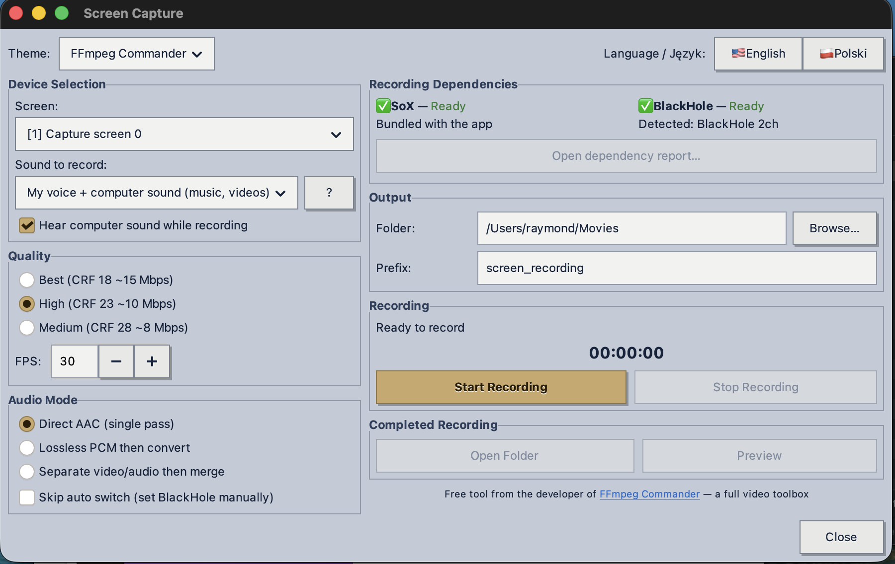

# Screen Capture for Mac

  

A free, self-contained screen recorder for macOS. Record your screen with your
voice, with the computer's sound, or both mixed together in one file.

**[⬇ Download the latest version](https://github.com/rompstar/screen-capture-mac/releases/latest/download/ScreenCapture_Mac.zip)**

> [!NOTE]
> **Signed & notarized by Apple.** Built by a registered Apple Developer and notarized by Apple, so it opens the normal way with a double-click. No "unidentified developer" warning, no right-click workaround, nothing extra to do.

Full instructions, permission setup, and FAQ:
**https://ffmpegcommander.com/screen-recorder.html**

## What it does

- Records your screen to MP4, hardware-encoded (Apple VideoToolbox H.264)
- Three sound modes: your voice, the computer's sound, or both mixed
- Live monitoring — keep hearing the audio while you record
- Everything runs locally on your Mac. No account, no cloud, no uploads.

## Requirements

- Mac with Apple Silicon (M1 or newer)
- Recording the computer's sound needs the free
  [BlackHole](https://existential.audio/blackhole/) audio driver — the app has
  a one-click installer for it built in

## From the maker of FFmpeg Commander

This tool grew out of [FFmpeg Commander](https://ffmpegcommander.com), a full
video toolbox for Mac, Windows, and Linux — converting, editing, transcribing,
all local on your machine. If you want to edit what you record, that's the tool
for it.
